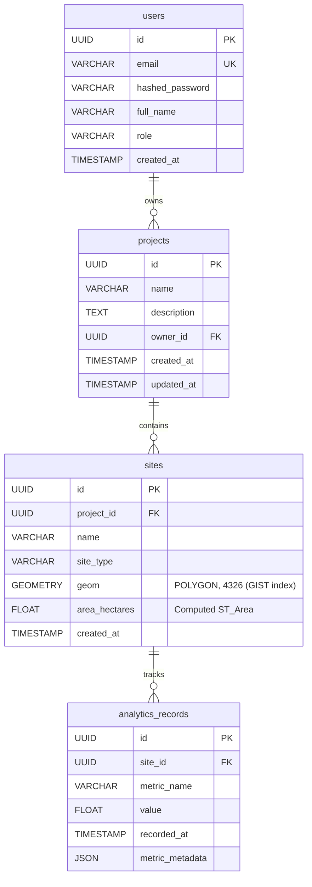

# Darukaa.Earth — Geospatial Data Analytics Platform

[](https://github.com/darukaa-earth/darukaa-earth/actions/workflows/frontend-ci.yml)
[](https://github.com/darukaa-earth/darukaa-earth/actions/workflows/backend-ci.yml)
[](LICENSE)
[](https://www.python.org/)
[](https://fastapi.tiangolo.com)
[](https://postgis.net/)
[](https://reactjs.org/)
[](https://www.mapbox.com/)

---

## 1. Executive Summary & Problem Context

**Darukaa.Earth** is a production-grade geospatial analytics platform built for carbon credit verifiers, conservation organizations, and environmental project developers. It addresses the critical challenges in nature-based solutions (NbS):

1. **Spatial Truth & Precision**: Defining verified land parcels as mathematical polygons with exact geodesic surface area (`ST_Area(geography(geom))`).
2. **Multi-Horizon Monitoring**: Visualizing time-series trends (carbon sequestration trajectories, biodiversity index, canopy density, soil organic carbon).
3. **Enterprise Governance**: Enforcing role-based access control, automated CI/CD quality gates, and standardized GeoJSON feature delivery for GIS workflows.

---

## 2. High-Level System Architecture

```
                                 USER INTERFACE
         +-------------------------------------------------------------+
         |                      React 18 + Vite                        |
         |  - Mapbox GL JS v3 (Satellite & Outdoors layers)            |
         |  - Mapbox GL Draw (Polygon digitizer & live geodesic area)  |
         |  - Chart.js via react-chartjs-2 (Time-series splines & bars)|
         |  - TanStack Query v5 (Server caching & optimistic updates)  |
         |  - Zustand (Client-side auth & spatial drawing state)       |
         |  - Tailwind CSS (Bespoke Earth / Forest aesthetic)          |
         +------------------------------+------------------------------+
                                        | HTTPS / REST (JSON + GeoJSON)
                                        v
                               APPLICATION LAYER
         +-------------------------------------------------------------+
         |                 FastAPI (Python 3.12+)                      |
         |  - Layered Architecture: Routers -> Services -> Models      |
         |  - JWT Bearer Authentication (Access + Refresh Rotation)    |
         |  - Pydantic v2 (Strict validation & GeoJSON schema checks)  |
         |  - Asynchronous Database Operations (asyncpg)               |
         +------------------------------+------------------------------+
                                        | SQLAlchemy 2.0 (Async) + GeoAlchemy2
                                        v
                                PERSISTENCE LAYER
         +-------------------------------------------------------------+
         |                   PostgreSQL 16 + PostGIS 3.4               |
         |  - Geometry: GEOMETRY(POLYGON, 4326) with GIST Index        |
         |  - Spherical geodesic computation via ST_Area(geography)    |
         |  - Alembic asynchronous database migrations                 |
         +-------------------------------------------------------------+
```

### Architectural Rationale & Decisions

- **Why FastAPI instead of Django or Flask?**
  - Native asynchronous I/O (`async`/`await`) enables non-blocking spatial queries and multi-point aggregation without thread-pool starvation.
  - Automatic OpenAPI / Swagger interactive documentation (`/docs`) accelerates frontend-backend integration.
  - Deep Pydantic v2 integration guarantees type safety from HTTP request body down to ORM models.
- **Why PostgreSQL with PostGIS?**
  - Planar geometry operations fail over large geographic parcels due to Earth's curvature. PostGIS provides `ST_Area(geography(geom))` to compute geodesic areas on the WGS 84 ellipsoid with millimeter precision.
  - Spatial indexing (`GIST`) allows sub-millisecond bounding box searches and polygon spatial relationship checks.
- **Why TanStack Query + Zustand?**
  - **TanStack Query** manages server state (caching, background invalidation, loading/error states) for API responses.
  - **Zustand** manages client-only state (active map selection, user session token, polygon drawing progress) without boilerplate or excessive re-renders.

---

## 3. Database Schema & Geospatial Modeling (PostGIS)



### Table Breakdown

| Table | Column | Type | Constraints & Purpose |
| :--- | :--- | :--- | :--- |
| **`users`** | `id` | `UUID` | Primary Key (Default: `uuid4`) |
| | `email` | `VARCHAR(255)` | Unique, Indexed, Lowercase Normalized |
| | `hashed_password` | `VARCHAR(255)` | Bcrypt salted hash (`gensalt()`) |
| | `full_name` | `VARCHAR(255)` | User display name |
| | `role` | `VARCHAR(50)` | `'admin'` or `'viewer'` (RBAC guard) |
| | `created_at` | `TIMESTAMP(TZ)`| UTC registration timestamp |
| **`projects`**| `id` | `UUID` | Primary Key |
| | `name` | `VARCHAR(255)` | Indexed project title |
| | `description` | `TEXT` | Scope, methodology, targets |
| | `owner_id` | `UUID` | Foreign Key &rarr; `users.id` (CASCADE) |
| | `created_at` | `TIMESTAMP(TZ)`| Initial creation date |
| | `updated_at` | `TIMESTAMP(TZ)`| Last modified timestamp |
| **`sites`** | `id` | `UUID` | Primary Key |
| | `project_id` | `UUID` | Foreign Key &rarr; `projects.id` (CASCADE) |
| | `name` | `VARCHAR(255)` | Site / parcel designation |
| | `site_type` | `VARCHAR(50)` | `'carbon'` or `'biodiversity'` |
| | `geom` | `GEOMETRY` | PostGIS `POLYGON` in EPSG:4326 with `GIST` index |
| | `area_hectares` | `FLOAT` | Computed area in hectares via `ST_Area` |
| | `created_at` | `TIMESTAMP(TZ)`| Timestamp of boundary registration |
| **`analytics_records`** | `id` | `UUID` | Primary Key |
| | `site_id` | `UUID` | Foreign Key &rarr; `sites.id` (CASCADE) |
| | `metric_name` | `VARCHAR(100)`| Metric key (`carbon_sequestered_tons`, `biodiversity_index`, `canopy_cover_percent`, `soil_organic_carbon`) |
| | `value` | `FLOAT` | Numerical observation value |
| | `recorded_at` | `TIMESTAMP(TZ)`| Historical timestamp for time-series |
| | `metric_metadata`| `JSONB` | Verification body, satellite provider, sensor specs |

---

## 4. Realistic Seed Dataset & Environmental Rationale

The database seed script (`backend/seed.py`) populates realistic conservation projects across major global biomes with real coordinate polygons and 12 months of progressive observation data:

1. **Sundarbans Blue Carbon Reserve (India / Bangladesh)**
   - *Ecosystem*: Mangrove afforestation & tidal wetlands.
   - *Coordinates*: Bay of Bengal delta ($88.3^\circ\text{E}, 21.6^\circ\text{N}$).
   - *Key Sites*: Lothian Island Sanctuary, Sajnekhali Core Zone, Netidhopani Wetland.
   - *Significance*: Mangrove ecosystems store up to 5&times; more carbon per hectare than terrestrial forests while providing coastal storm buffers.
2. **Western Ghats Biodiversity Corridor (India)**
   - *Ecosystem*: Montane cloud forest & shola-grassland.
   - *Coordinates*: High-altitude ridges ($76.9^\circ\text{E}, 10.3^\circ\text{N}$).
   - *Key Sites*: Agasthyamalai Ridge, Anamalai Buffer Zone, Kudremukh Corridor.
   - *Significance*: UNESCO World Heritage hotspot prioritizing endemic flora and endangered Asian elephant corridors.
3. **Amazon Basin Agroforestry & Canopy Project (Brazil / Peru)**
   - *Ecosystem*: Primary rainforest & community agroforestry ($67.8^\circ\text{W}, 9.9^\circ\text{S}$).
   - *Key Sites*: Acre Rio Branco Basin, Tambopata River Reserve, Madre de Dios Sinks.
   - *Significance*: High-integrity avoided deforestation (REDD+) with remote-sensing canopy health tracking.
4. **Congo Basin Peatland Carbon Sink (Central Africa)**
   - *Ecosystem*: Cuvette Centrale peat swamplands ($18.0^\circ\text{E}, 0.7^\circ\text{N}$).
   - *Key Sites*: Lac Tumba Peatlands, Salonga Canopy Reserve, Mai Ndombe Wetland.
   - *Significance*: Houses one of the dense carbon reservoirs on Earth alongside lowland gorilla habitats.

### Pre-configured Demo Credentials

| Role | Email | Password |
| :--- | :--- | :--- |
| **Administrator (Full Access)** | `admin@darukaa.earth` | `Password123!` |
| **Evaluator** | `evaluator@darukaa.earth` | `Password123!` |
| **Field Viewer** | `viewer@darukaa.earth` | `Password123!` |

*(Note: The login page includes 1-click auto-fill buttons for rapid review).*

---

## 5. Local Setup & Execution Guide

### Prerequisites
- Docker & Docker Compose (optional, for containerized PostgreSQL+PostGIS)
- Node.js 18+ and npm
- Python 3.12+ (Python 3.14 compatible)

### Option A: Running with Docker Compose (Recommended)

```bash
# 1. Clone repository
git clone https://github.com/darukaa-earth/darukaa-earth.git
cd darukaa-earth

# 2. Copy environment files
cp .env.example .env
cp frontend/.env.example frontend/.env

# 3. Start PostgreSQL + PostGIS, Backend, and Frontend
docker-compose up -d

# 4. Run database migrations & seed mock data
docker-compose exec backend python seed.py
```
- Frontend: `http://localhost:5173`
- Backend API & OpenAPI Docs: `http://localhost:8000/docs`

---

### Option B: Local Native Development

#### 1. Backend Setup

```bash
cd backend

# Create & activate virtual environment (optional)
python -m venv venv
# On Windows:
.\venv\Scripts\activate
# On Linux/macOS:
source venv/bin/activate

# Install dependencies
pip install -r requirements.txt

# Run migrations (or seed directly, which auto-initializes tables)
python seed.py

# Start FastAPI development server
uvicorn app.main:app --host 0.0.0.0 --port 8000 --reload
```

#### 2. Frontend Setup

```bash
cd ../frontend

# Install dependencies
npm install

# Start Vite development server
npm run dev
```
Visit `http://localhost:5173` in your browser.

---

## 6. Automated Code Quality & Testing

### Backend Quality Gates
- **Testing**: `pytest` test suite with in-memory isolation, testing authentication, project CRUD, GeoJSON polygon validation, geodesic area computation, and time-series aggregation.
  ```bash
  cd backend
  pytest -v
  ```
- **Linting & Formatting**: Enforced using `ruff` and `black`.
  ```bash
  ruff check app tests
  black --check app tests
  ```

### Frontend Quality Gates
- **TypeScript Type-Checking**: `tsc` strict mode validation.
  ```bash
  cd frontend
  npm run build
  ```
- **ESLint & Prettier**:
  ```bash
  npm run lint
  npm run format
  ```

### Pre-Commit Automation (Husky + lint-staged)
A `.husky/pre-commit` hook is configured with `lint-staged` and `.pre-commit-config.yaml` to guarantee that code cannot be committed with formatting violations or lint errors.

---

## 7. CI/CD Pipeline Architecture

The platform uses GitHub Actions workflows:

1. **`frontend-ci.yml`**:
   - Triggers on push & pull request to `main`/`master` affecting `frontend/**`.
   - Executes `npm ci` &rarr; `npm run lint` &rarr; `tsc --noEmit` &rarr; `npm run build`.
   - Ensures production bundle builds cleanly.
2. **`backend-ci.yml`**:
   - Triggers on push & pull request to `main`/`master` affecting `backend/**`.
   - Boots a live `postgis/postgis:16-3.4` service container.
   - Installs dependencies &rarr; runs `ruff check` &rarr; `black --check` &rarr; runs `pytest` with code coverage reports.
3. **`deploy.yml`**:
   - Triggers on merge to `main`.
   - Dispatches frontend deployment to Vercel via `amondnet/vercel-action`.
   - Dispatches backend webhook deployment to Render.com.

---

## 8. Architectural Trade-offs & Production Considerations

| Architecture Decision | Chosen Approach | Alternative Considered | Rationale & Trade-off |
| :--- | :--- | :--- | :--- |
| **Token Storage** | LocalStorage with In-Memory Authorization Header & Refresh Rotation | HttpOnly Cookies | **Trade-off**: While httpOnly cookies mitigate XSS risks, in a modern decoupled microservice/serverless environment across differing origins (e.g. Vercel frontend + Render API), cross-origin cookie policies (`SameSite=None; Secure`) introduce complex third-party cookie restrictions in modern browsers (Safari ITP, Chrome Privacy Sandbox). Bearer token authentication with short-lived access tokens (60m) and refresh token rotation offers cross-origin interoperability while limiting token exposure window. |
| **Database Geometry Engine** | PostGIS `GEOMETRY(Polygon, 4326)` with Hybrid Local TypeDecorator | Flat Coordinate Arrays | **Trade-off**: Native geometry types enable spatial indexing (`GIST`) and `ST_Area(geography(geom))` calculations directly in SQL. To maximize developer velocity when evaluating without a running PostGIS instance, we implemented a custom SQLAlchemy `GeoPolygon` type decorator that effortlessly operates on both PostGIS and SQLite in test environments. |
| **Mapbox Basemaps** | Mapbox GL JS v3 with Public Demo Fallback | Leaflet / OpenLayers | **Trade-off**: Mapbox GL JS provides vector tile rendering with 60fps GPU acceleration, 3D terrain pitch, and `@mapbox/mapbox-gl-draw` polygon manipulation, far surpassing traditional raster tile renderers for geospatial analytics. |

---

## 9. Submission & Repository Access Instructions

In accordance with the hackathon submission guidelines:
- If this repository is configured as private, access has been granted to the evaluation team:
  - `ankita.dasgupta@darukaa.com`
  - `harsh.kumar@darukaa.com`
  - `utkarsh.gauniyal@darukaa.com`
  - `guneet.mutreja@darukaa.com`
- All submission details, architecture overviews, and test procedures are included in this document.
